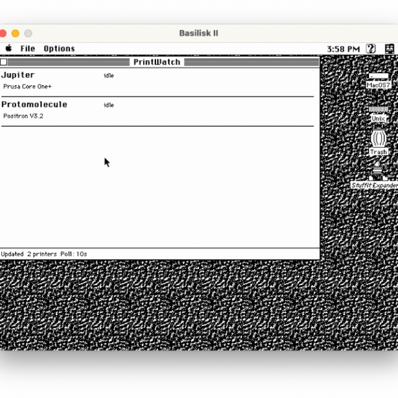
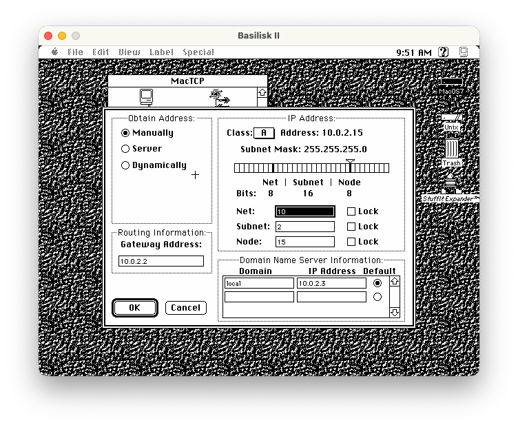

# PrintWatch

A 3D printer monitoring app for the Macintosh SE, built for System 7. A Python proxy polls modern printer APIs (PrusaLink, Moonraker) and serves normalized status over HTTP/1.0 for the classic Mac client.



## Architecture

```
┌──────────────┐        ┌───────────────┐        ┌──────────────┐
│  Mac SE App  │──HTTP──│  Proxy Server │──poll──│  3D Printers │
│  (System 7)  │  1.0   │  (Python)     │        │  (LAN)       │
└──────────────┘        └───────────────┘        └──────────────┘
```

## Proxy Setup

### Prerequisites

- [uv](https://docs.astral.sh/uv/getting-started/installation/) (Python package manager)

### Install and Run

```bash
uv sync

cp proxy/config.example.yaml config.yaml
# Edit config.yaml with your printer addresses and credentials

uv run printwatch-proxy config.yaml
```

The proxy starts on port 8080 by default and polls your printers at the configured interval.

### Configuration

Copy `proxy/config.example.yaml` and edit it:

```yaml
proxy:
  host: "0.0.0.0"
  port: 8080
  poll_interval: 10    # seconds between polls

printers:
  - id: "mk4"
    name: "Prusa MK4"
    type: "prusalink"   # or "moonraker"
    model: "mk4"        # controls icon in detail view (see models.yaml)
    url: "http://192.168.1.50"
    username: "maker"
    password: "your-api-key-here"
```

### Camera Snapshots

Printers with an RTSP camera (e.g. the BuddyCam on Core One) can send
1-bit dithered snapshots to the Mac client. Requires `ffmpeg` on the proxy host.

```yaml
  - id: "core_one"
    type: "prusalink"
    url: "http://192.168.1.50"
    camera: true
    camera_url: "rtsp://192.168.1.51/live"
```

**BuddyCam setup**: RTSP must be enabled through the Prusa mobile app
(Printer Settings > Camera > Local RTSP stream). The camera IP is separate
from the printer IP — check your router's device list.

### API

- `GET /printers` — all printer statuses as JSON
- `GET /printers/{id}` — single printer status
- `GET /printers/{id}/snapshot` — latest camera snapshot (binary PIMG)

### Tests

```bash
uv run pytest proxy/tests/
```

### Printer Model Images

The Mac client shows a 1-bit dithered image of the printer model in the detail view. All model definitions live in a single source of truth: `assets/icons/models.yaml`. The generation script reads it and produces three outputs:

- `resources/PrintWatchIcons.r` — Rez PIMG resources (compiled into the Mac app)
- `src/icon_map.inc` — C lookup table mapping model strings to resource IDs
- `proxy/model_names.py` — Python dict mapping model strings to display names

```bash
# Generate all outputs from models.yaml + source PNGs
uv run python scripts/generate_icons.py

# Also generate a scaled-up preview image for visual QA
uv run python scripts/generate_icons.py --preview preview.png
```

To add a new printer model:

1. Add an entry to `assets/icons/models.yaml`
2. Drop a pre-dithered 1-bit PNG in `assets/icons/` (max 200px tall)
3. Run `uv run python scripts/generate_icons.py`
4. Rebuild the Mac app

Models with images: `core_one`, `core_one_l`, `micron`, `positron`, `v0`, `v2_4`, `xl`. Others fall back to no image.

The generated files are committed so the Retro68 build doesn't depend on Pillow.

## Mac SE Client

The client is a System 7 application built with the Retro68 cross-compiler toolchain.

### Prerequisites

```bash
brew install cmake gmp mpfr libmpc boost bison flex texinfo
```

### Build Retro68 (one-time, ~30-60 min)

```bash
git clone --recursive https://github.com/autc04/Retro68.git ~/Code/Retro68
mkdir ~/Code/Retro68-build && cd ~/Code/Retro68-build
../Retro68/build-toolchain.bash --no-ppc --clean-after-build
```

### Build the App

```bash
mkdir build && cd build
cmake .. -DCMAKE_TOOLCHAIN_FILE=~/Code/Retro68-build/toolchain/m68k-apple-macos/cmake/retro68.toolchain.cmake
make
```

### Test in Basilisk II

```bash
cp build/PrintWatch.bin ~/Code/Basilisk\ II/shared/
```

The file appears on the emulated Mac's desktop as a mounted volume.

#### First-time network setup

BasiliskII uses SLiRP for networking. On the first launch, open the MacTCP control panel and configure it with the SLiRP defaults:

- **Class**: A
- **Obtain Address**: Manually
- **IP Address**: 10.0.2.15
- **Gateway**: 10.0.2.2
- **DNS**: 10.0.2.3 (set domain to `local`)
- **Subnet Mask**: 255.255.255.0



## Toolchain

| Component | Location |
|-----------|----------|
| Retro68 source | `~/Code/Retro68` |
| Build output / toolchain | `~/Code/Retro68-build/toolchain/` |
| CMake toolchain file | `~/Code/Retro68-build/toolchain/m68k-apple-macos/cmake/retro68.toolchain.cmake` |
| Basilisk II | `~/Code/Basilisk II/` |

## Documentation

See `docs/` for detailed guides:

- **[RETRO68_SETUP.md](docs/RETRO68_SETUP.md)** — Toolchain reference and troubleshooting
- **[EMULATOR_SETUP.md](docs/EMULATOR_SETUP.md)** — Basilisk II and Mini vMac configuration
- **[WORKFLOW.md](docs/WORKFLOW.md)** — Dev workflow with Claude Code
